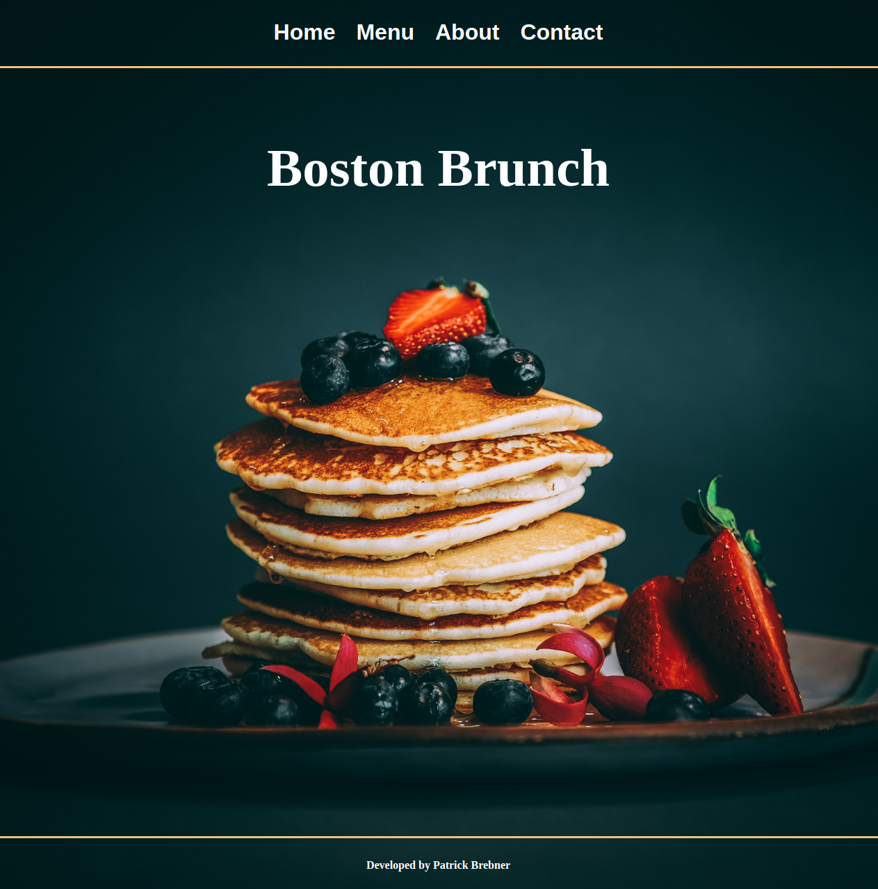

# Restaurant Page

## About

A dynamically rendered restuarant hompage as part of The Odin Project.

Note: As part of the exercise learning experience, DOM elements were created using Javascript and the main section was loaded dynamically as required

[Check it out](https://pbrebner.github.io/restaurant-page/)

## Topics Covered

-   ES6 Modules
-   Webpack
-   Dynamically loading a website
